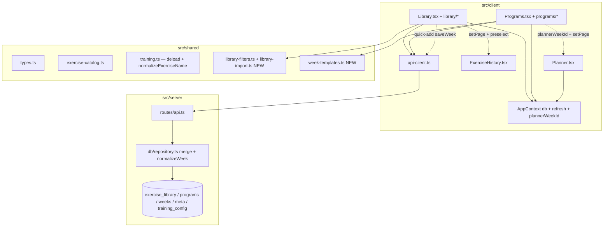
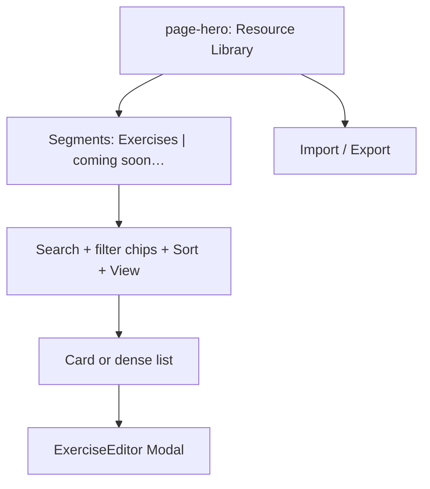
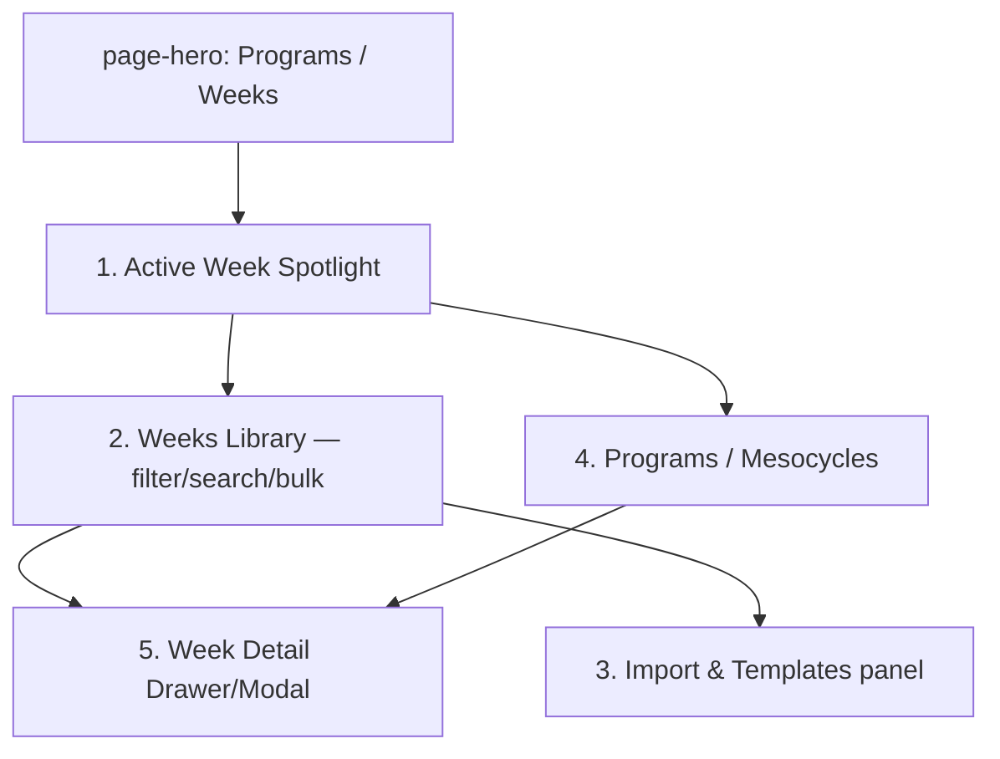
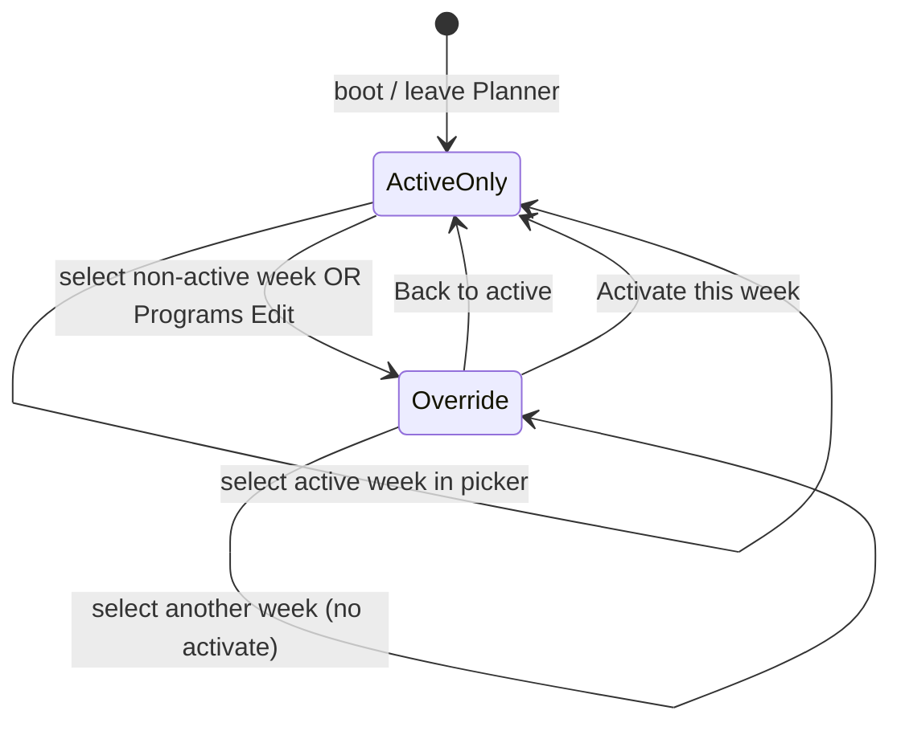
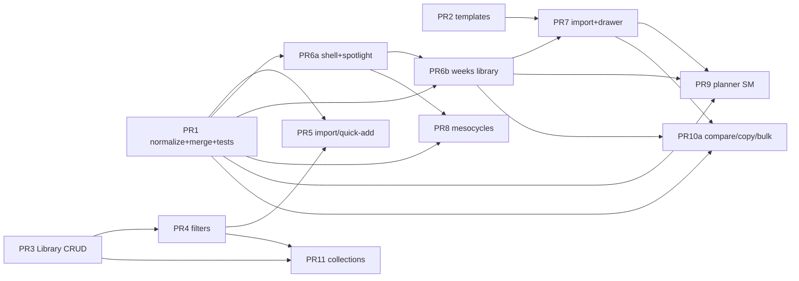

# Ultra Pro Library + Programs Pages Redesign

| Field | Value |
|-------|--------|
| **Author** | Workout OS design (review cycle) |
| **Date** | 2026-08-06 |
| **Status** | Approved-ready (all review gates closed; minor nits resolved) |
| **Workspace** | `D:\Workout OS` |
| **Primary surfaces** | `src/client/pages/Library.tsx`, `src/client/pages/Programs.tsx` |
| **Related** | Planner, ExerciseHistory, Tracker, Dashboard, Calendar |

---

## Overview

Workout OS already has the data primitives for a serious training library and multi-week programming hub, but the **Library** page is a read-only flat list with stub create/import, and the **Programs** page is a single scroll of five unrelated concerns (mesocycle compose, templates, JSON import, saved weeks, deload). This design reorganizes both into production-grade, Hevy/Strong/RP-style command centers while **extending existing types and APIs**—not rewriting the stack.

**Library** becomes a **resource collection** (exercises first; other resource kinds later) with search, multi-filter, full CRUD, bulk ops, favorites, family grouping, history links, and quick-add into the active week.

**Programs** becomes a **week + mesocycle command center** with an active-week spotlight, filterable weeks library, import/templates panel, program timeline, week detail drawer, and first-class week/program operations.

Three backend write-path fixes are foundational (PR 1):

1. **`normalizeWeek` field preservation** — types already declare `programId`/`phase`/`exerciseId`/etc.; the normalizer currently strips them (also breaking deload’s intended `phase` + `rirTarget`).
2. **Server-side week merge on PUT** — `PUT /api/weeks/:id` does not merge with the stored week today; partial metadata saves will 400 or wipe days unless the server merges.
3. **API field whitelists** — Exercise `meta` and Program `archived`/`updatedAt` must be passed through explicitly (same pattern as today’s fixed object builders).

---

## Background & Motivation

### Current state (verified in code)

#### Library — `src/client/pages/Library.tsx` (~125 lines)

| Capability | Status |
|------------|--------|
| List exercises from `db.exercises` | Yes (flat `page-list`) |
| JSON import via `app.api.importExercises` | Yes |
| Create custom exercise | Stub only: hard-coded defaults, no editor |
| Search / filter / sort | **Missing** |
| Edit / delete UI | **Missing** (API has `DELETE /api/exercises/:id`, client has `deleteExercise`) |
| Collections, tags, favorites | **Missing** |
| Link to Exercise History | **Missing** |
| Quick-add to Planner | **Missing** (Planner has one-way `pickFromLibrary`) |

Exercise model already supports rich metadata (`src/shared/types.ts`):

```ts
Exercise {
  id, name, aliases[], muscles[], equipment, movementPattern,
  substitutions[], bodyPart?, workoutSplit?, tutorialLink?,
  familyId?, defaultCue?, defaultRestSec?, defaultTempo?
}
```

- Seed catalog: `src/shared/exercise-catalog.ts` (~30 exercises, families for bench/squat/deadlift/ohp)
- Storage: SQLite JSON blob table `exercise_library` (`listExercises` / `saveExercise` / `deleteExercise` in `src/server/db/repository.ts`)
- API: `GET/POST /api/exercises`, `POST /api/exercises/import`, `DELETE /api/exercises/:id` (`src/server/routes/api.ts`)
- Client: `src/client/lib/api-client.ts` — `listExercises`, `saveExercise`, `importExercises`, `deleteExercise`, `exerciseHistory`
- **Write semantics:** `saveExercise` **replaces the entire JSON blob** for that id. `POST /api/exercises` builds a fixed object from body fields (missing fields become empty defaults). Clients must always send a **full exercise document**.

#### Programs — `src/client/pages/Programs.tsx` (~696 lines)

One long page mixing:

1. Multi-week program compose (checkbox weeks + phase select + save)
2. Saved programs list (name, phase pills, delete only)
3. Built-in templates (PPL, Upper/Lower, Full Body) — **inline in page**
4. JSON import + file + download template
5. Saved weeks expand/collapse + ⋯ menu (activate, complete, duplicate, delete) + AI biomechanics per exercise

Templates are defined **inside** `Programs.tsx` (`templatePpl`, `templateUpperLower`, `templateFullBody`, `sampleWeek`) — not shared.

#### Planner coupling

- Planner (`src/client/pages/Planner.tsx`) binds to **active week only** for resolution (`db.meta.activeWeekId`).
- **Week `<select>` force-activates** on change (`Planner.tsx` ~193–197: `await app.api.activateWeek(e.target.value)`). Any `plannerWeekId` design **must** change this control so selecting a week for editing does not activate it.
- Library pick: `pickFromLibrary(i, exerciseId)` copies `name`, first muscle → `target`, `defaultCue`, `exerciseId`, `familyId`, `defaultRestSec`, `defaultTempo` into `PlannedExercise`.
- Non-active weeks can be viewed on Programs; **Edit** only appears when `active`.
- Dirty-state confirm already exists for day chips and week select.

#### Critical data bug: `normalizeWeek` strips typed fields

`src/server/db/repository.ts` → `normalizeWeek()` rebuilds weeks without:

| Dropped field | On type |
|---------------|---------|
| `programId`, `phase` | `Week` |
| `scheduledDate` | `WeekDay` |
| `exerciseId`, `familyId`, `supersetGroup`, `percent1rm`, `rirTarget`, `rpeTarget`, `tempo`, `restSec`, `notes` | `PlannedExercise` |

**Broader production impact (already broken today):**

| Path | Intended fields | Result after `upsertWeek` |
|------|-----------------|---------------------------|
| `POST /api/weeks/deload-from/:weekId` | `phase: 'deload'`; exercises with `rirTarget`, adjusted `percent1rm` (`buildDeloadWeekDays`) | **Stripped** |
| Planner `pickFromLibrary` → `saveWeek` | `exerciseId`, `familyId`, `restSec`, `tempo` | **Stripped** |
| `duplicateWeek` / import / PUT | Any advanced fields on source | **Stripped** |

Any `PUT /api/weeks/:id` or `import` through `upsertWeek` **silently loses** Planner-linked library IDs and program phase metadata. Programs redesign **must** fix this in PR 1 with **required** regression tests.

#### Critical write-path gap: PUT week is not a partial update

Verified:

- `PUT /api/weeks/:weekId` → `repo.upsertWeek({ ...req.body, id })` with **no** spread of `existing` (`api.ts` ~544–549).
- `upsertWeek` → `normalizeWeek` requires `name` and `days`; missing either throws.
- Client type `Partial<Week>` on `saveWeek` is **misleading**; working call sites always send a full week (Planner, Dashboard missionObjective).

Metadata-only saves (`{ phase, programId }`) will **400** or, if `days: []` is sent naïvely, **wipe** the plan. PR 1 must add **server merge** (see [API / Interface Changes](#api--interface-changes)).

#### Program POST whitelist

`POST /api/programs` builds a fixed object (`id`, `name`, `notes`, `weeks`, `active`, `createdAt`) and **drops** unknown fields. Optional `archived` / `updatedAt` will not persist until the whitelist is extended (same class of bug as Exercise `meta`).

#### What works and should be reused

| Asset | Path / symbol |
|-------|----------------|
| UI shell | `page-shell`, `page-hero`, `page-panel`, `pill-*`, `btn`, `input`, `menu-panel` |
| Modal | `src/client/components/Modal.tsx` (Esc + focus trap) |
| Toast | `useToast` |
| App state | `AppContext`: `db`, `refresh`, `setPage`, `setActiveDay`, `setManualDay`, `api` |
| Week status | `weekStatus(week, sessions)` in `src/client/lib/utils.ts` |
| Name normalize | `normalizeExerciseName` in `src/shared/training.ts` (reuse; do not redefine) |
| Deload builder | `buildDeloadWeekDays` in `src/shared/training.ts`; `POST /api/weeks/deload-from/:weekId` |
| Week APIs | activate, complete, duplicate, delete, import, saveWeek (PUT) |
| Program APIs | `saveProgram`, `deleteProgram` |
| Exercise history | `ExerciseHistory.tsx` + `GET /api/exercise-history?name=` |
| Body size | `express.json({ limit: '10mb' })` in `src/server/app.ts` |
| Nav | `App.tsx` NAV_META — Library & Programs in `train` group |
| Tests pattern | `src/server/services/*.test.ts` (metrics, readiness, googleFit) — no repository week tests yet |

---

## Goals & Non-Goals

### Goals

1. **Library as resource hub**: Search, multi-filter, sort, full CRUD modal, bulk import/export, favorites, recently/most used, family groups, history deep-link, quick-add to active week day.
2. **Programs as command center**: Clear IA (active spotlight → weeks library → import/templates → mesocycles); week detail drawer; full week/program ops; visual phase timeline.
3. **Preserve local-first model**: SQLite JSON tables; single-user; extend blobs/types rather than multi-tenant cloud schemas.
4. **Match existing UI language**: page-hero/panel/pills/modals; no new design system (v1 Library = single-column toolbar chips, not a new sidebar rail primitive).
5. **Incremental delivery**: Independently mergeable PRs (see [PR Plan](#pr-plan)).
6. **Fix data fidelity**: `normalizeWeek` preserves all typed fields; **server merges week PUT** with existing row; deload/Planner linkage survives round-trips (required tests).

### Non-Goals

- Multi-user sync, cloud sharing, or coach-client portals.
- Full rewrite of Planner/Tracker UX (only minimal hooks for non-active week edit + library quick-add).
- Shipping all secondary resource types (mobility, set schemes, cue cards) in v1 — **schema + IA only**; Exercises ship first.
- Android-specific UI (`android_version/` follows root `src/` later).
- Replacing AI biomechanics — keep as optional secondary action, not primary chrome.
- Real-time collaborative editing or offline CRDT.
- Remote APM / blocking UI PRs on `logEvent` coverage for client-only actions.

---

## Proposed Design

### High-level architecture



### Information architecture

#### Library page IA (v1 layout)



**v1 layout decision:** single-column `page-panel` stack with a **sticky filter/toolbar row** (chips). Do **not** introduce a two-column Favorites/Families sidebar rail in v1 — that pattern is not used elsewhere and would fight existing CSS. Collections filter is a chip/select when PR 11 ships collections. Optional rail can land later as polish if needed.

**Default resource tab:** Exercises.

**Future tabs** (disabled or “Coming soon” chips until phase 2): Warm-ups, Mobility, Cue cards, Set schemes, Equipment notes.

#### Programs page IA



Use **page-level segments** (`Active · Weeks · Import · Programs`) that swap panels (one at a time on mobile) to avoid another 700-line wall.

---

## Library — Detailed Design

### 1. Resource model (extensible, exercises first)

Keep `Exercise` as the primary concrete type. Introduce a **thin envelope** for future resources without forcing a polymorphic table rewrite:

```ts
// src/shared/types.ts — additive

export type LibraryResourceKind =
  | 'exercise'
  | 'warmup'
  | 'mobility'
  | 'cue_card'
  | 'set_scheme'
  | 'equipment_note';

/** Optional org metadata stored on Exercise (and later other kinds) */
export interface LibraryMeta {
  tags?: string[];           // freeform; usable before full collections UI
  collectionIds?: string[];  // refs into TrainingConfig.libraryCollections
  favorite?: boolean;
  archived?: boolean;
  lastUsedAt?: string;       // ISO — optional; can derive from sessions
  useCount?: number;
  notes?: string;
  createdAt?: string;
  updatedAt?: string;
}

export interface Exercise {
  // …existing fields…
  meta?: LibraryMeta;
}

/** Named collection / folder — stored on TrainingConfig */
export interface LibraryCollection {
  id: string;
  name: string;
  color?: string;
  kind?: LibraryResourceKind | 'mixed';
  createdAt: string;
}

export interface TrainingConfig {
  // …existing: volumeLandmarks, exerciseFamilies, reminders, gymModeDefault, bar weights…
  /** v1 collections storage — decided */
  libraryCollections?: LibraryCollection[];
}

/** Client-only preference bag (localStorage) */
export interface LibraryUiPrefs {
  /** Shipped sorts in PR 4 — keep in sync with UI */
  sort: 'name' | 'recent' | 'most_used' | 'muscle' | 'equipment' | 'created';
  view: 'cards' | 'dense';
  /** Family is a view mode, not a sort key */
  groupByFamily: boolean;
  filters: Record<string, string[]>;
}
```

**Storage strategy (decided for v1):**

| Data | Where | Rationale |
|------|--------|-----------|
| Exercise + `meta` | `exercise_library.data` JSON | Flexible blob; no migration |
| Collections | **`TrainingConfig.libraryCollections`** | Already backed by `POST /api/training-config`; no new table; included in backup via config |
| UI prefs | `localStorage` key `workout-os-library-prefs` | Device-local |

**`saveTrainingConfig` merge rule for collections:**

```ts
// repository.saveTrainingConfig — extend next to volumeLandmarks / exerciseFamilies / reminders
libraryCollections: cfg.libraryCollections !== undefined
  ? cfg.libraryCollections   // replace-array semantics (client owns full list)
  : current.libraryCollections,
```

- **Replace-array** when client sends `libraryCollections` (create/rename/delete collection = send full array).
- Omit key → leave previous collections unchanged.
- Do **not** deep-merge by id on the server in v1 (simpler; client is single-writer local).

**Phase 2 resource types** (not shipped UI): separate tables later. Exercises stay in `exercise_library`.

### 2. Client structure

```
src/client/pages/Library.tsx                 # shell + segments
src/client/pages/library/
  ExerciseGrid.tsx                           # list/cards
  ExerciseFilters.tsx                        # multi-filter chips
  ExerciseEditorModal.tsx                    # full CRUD
  LibraryToolbar.tsx                         # search, sort, bulk
  QuickAddToWeekModal.tsx                    # day + slot picker
  useLibraryQuery.ts                         # filter/sort memo
src/shared/library-filters.ts                # pure filter/sort (unit-tested)
src/shared/library-import.ts                 # merge/dedupe; imports normalizeExerciseName from training.ts
```

### 3. Search, filter, sort

**Search** (client-side over `db.exercises`):

- Match: `name`, `aliases[]`, `muscles[]`, `equipment`, `movementPattern`, `bodyPart`, `familyId`, `meta.tags`

**Filters** (multi-select chips):

| Filter | Source field |
|--------|--------------|
| Muscle | `muscles[]` |
| Equipment | `equipment` |
| Pattern | `movementPattern` |
| Split | `workoutSplit` |
| Body part | `bodyPart` |
| Family | `familyId` |
| Favorites only | `meta.favorite` |
| Has tutorial | `tutorialLink` truthy |
| Collection | `meta.collectionIds` (after PR 11) |

**Sort keys (aligned with `LibraryUiPrefs.sort`):**

| Sort | Meaning |
|------|---------|
| `name` | A–Z |
| `recent` | by usage map `lastUsedAt` or session recency |
| `most_used` | by usage count |
| `muscle` | first muscle label |
| `equipment` | equipment string |
| `created` | `meta.createdAt` (newest first); missing → end |

**Family grouping:** separate boolean `groupByFamily` (not a sort value). When true, render section headers by `familyId` after sorting within groups.

Derive **recent / most used** from `db.sessions` (finished logs matching name/`exerciseId`) in the client; optional later persistence of `meta.useCount`/`lastUsedAt`.

```ts
// shared/library-filters.ts — pure, unit-tested in PR 4
export function filterExercises(/* … */): Exercise[] { /* … */ }
export function sortExercises(
  items: Exercise[],
  sort: LibraryUiPrefs['sort'],
  usage: Map<string, { lastUsedAt?: string; count: number }>,
): Exercise[] { /* … */ }
export function groupExercisesByFamily(items: Exercise[]): Map<string, Exercise[]> { /* … */ }
```

### 4. Exercise editor (full CRUD) + full-document save discipline

Reuse `Modal` with form sections:

1. **Identity** — name, aliases (comma/chips), familyId  
2. **Classification** — muscles (multi), equipment, movementPattern, bodyPart, workoutSplit  
3. **Defaults** — defaultCue, defaultRestSec, defaultTempo  
4. **Substitutions** — multi string  
5. **Media** — tutorialLink  
6. **Organization** — tags, collections (PR 11), favorite toggle  
7. **Danger** — delete (confirm)

**Full-document save rule (required — prevents silent wipe):**

```ts
// Client — always clone full exercise from db before mutate
async function toggleFavorite(ex: Exercise) {
  const next: Exercise = {
    ...ex,
    meta: { ...(ex.meta || {}), favorite: !ex.meta?.favorite, updatedAt: new Date().toISOString() },
  };
  await api.saveExercise(next as unknown as Record<string, unknown>);
  await refresh();
}

async function saveFromEditor(form: Exercise) {
  // form is complete; never POST { id, meta } alone
  await api.saveExercise({
    ...form,
    meta: { ...(form.meta || {}), updatedAt: new Date().toISOString() },
  });
}
```

Server `POST /api/exercises` must **pass through** `meta`:

```ts
meta: body.meta && typeof body.meta === 'object' ? body.meta : undefined,
```

Import path: same mapping. **Optional later:** server merge with existing row by id — not required if client always full-documents.

**Delete-exercise orphan policy (decided):**

- Delete removes the library row only.
- **Leave** planned/log **names** intact; **leave** dangling `exerciseId` on historical `PlannedExercise` / logs (no cascade rewrite of all weeks/sessions in v1).
- Editor danger zone copy: “Plans and logs keep the exercise name; library link may break.”
- Optional best-effort: scan `db.weeks` and null `exerciseId` where it matches deleted id — **out of v1**; document as follow-up if users hit confusion.

### 5. Bulk import / export & dedupe

**Import:**

- Accept array or `{ exercises: [] }` (client already unwraps)
- Modes: **Skip** (default, match normalized name) · **Merge** · **Replace**
- Soft cap: **2000** exercises per import loop (defense-in-depth; body already limited to **10mb** via `express.json`)

**Export:** selected/filtered or full catalog → `{ exercises, exportedAt, version: 1 }`

**Dedupe helper** — reuse existing name normalizer:

```ts
// src/shared/library-import.ts
import { normalizeExerciseName } from './training.js'; // already exists L160+

export function mergeExercise(existing: Exercise, incoming: Partial<Exercise>): Exercise {
  // union aliases, muscles, substitutions; prefer non-empty incoming defaults;
  // merge meta shallowly
}

export function planExerciseImport(
  existing: Exercise[],
  incoming: Exercise[],
  mode: 'skip' | 'merge' | 'replace',
): { toSave: Exercise[]; skipped: number; merged: number } { /* … */ }
```

Do **not** redefine `normalizeExerciseName` in `library-import.ts`.

### 6. Favorites, history, quick-add, family

| Feature | UX | Implementation |
|---------|-----|----------------|
| Favorite | Star on card; filter chip | Full-document save with `meta.favorite` |
| History | “History” → Exercise History | `sessionStorage` key `exercise-history-preselect` + `setPage('ExerciseHistory')` |
| Quick-add | “Add to week” → day picker | Algorithm below; **active week only** |
| Family | `groupByFamily` toggle; editor field | Existing `familyId` |

#### Quick-add algorithm

```ts
async function quickAddToActiveWeek(lib: Exercise, dayKey?: string) {
  const activeId = db.meta.activeWeekId;
  const week = structuredClone(db.weeks.find(w => w.id === activeId));
  if (!week) throw new Error('No active week');

  // Default day: localDayKey() if that day exists on the week, else first non-rest day, else first day
  const todayKey = localDayKey(); // existing util
  const key =
    dayKey ||
    (week.days.some(d => d.key === todayKey) ? todayKey : null) ||
    week.days.find(d => d.type !== 'rest')?.key ||
    week.days[0]?.key;
  if (!key) throw new Error('Week has no days');

  const day = week.days.find(d => d.key === key)!;
  if (day.type === 'rest' && !dayKey) {
    // If auto-picked a rest day only because week is all rest, still allow; if user must pick, open modal
  }

  const planned: PlannedExercise = {
    name: lib.name,
    target: lib.muscles[0] || 'Other',
    vol: '3 x 8-12',
    cue: lib.defaultCue || '',
    exerciseId: lib.id,
    familyId: lib.familyId,
    restSec: lib.defaultRestSec,
    tempo: lib.defaultTempo,
  };
  day.exercises = [...(day.exercises || []), planned];

  // Full-week payload (server merge also safe); preserves other days
  await api.saveWeek(week.id, week);
  await refresh();
  toast.push(`Added ${lib.name} to ${key}`, 'ok');
  // Note: if Planner is open on same week with dirty local state, user may overwrite on next Planner save —
  // toast: "Reload Planner if it is open with unsaved changes."
}
```

Default day in modal: preselect as above; user can change.

### 7. Empty / loading / keyboard UX

- Empty: `page-empty` + CTA Import / Custom exercise  
- Zero filter results: “Clear filters”  
- Keyboard: `/` search; `n` new; Esc modal  
- Responsive: filter chips wrap; cards → dense list under 640px  

### 8. Visual layout (Exercises tab, v1)

```
┌─────────────────────────────────────────────────────────┐
│ Resource Library                    [42] [★ 6] [Export] │
│ Search…  [Muscle] [Equip] [Pattern] [★ Fav] Sort▾ View  │
│ [ group by family ]                                     │
│ ┌────────┐ ┌────────┐ ┌────────┐                        │
│ │ Bench  │ │ Squat  │ │  OHP   │  …                     │
│ │ Chest  │ │ Quads  │ │ Should │                        │
│ │ ★  ⋯   │ │    ⋯   │ │    ⋯   │                        │
│ └────────┘ └────────┘ └────────┘                        │
└─────────────────────────────────────────────────────────┘
```

---

## Programs — Detailed Design

### 1. Page shell & navigation

Four panels under one hero (segment control):

| Panel | Purpose | Lands in |
|-------|---------|----------|
| **Active** | Spotlight: name, phase, progress, Start / Edit / Complete / Deload | PR 6a |
| **Weeks** | Searchable/filterable weeks + ops menus | PR 6b |
| **Import** | Templates + JSON + export | PR 7 |
| **Programs** | Mesocycle list/editor + phase timeline | PR 8 |

```
src/shared/week-templates.ts
src/client/pages/programs/
  ActiveWeekSpotlight.tsx
  WeeksLibrary.tsx
  WeekDetailDrawer.tsx
  ImportTemplatesPanel.tsx
  ProgramComposer.tsx
  ProgramTimeline.tsx
  WeekOpsMenu.tsx
  useWeekMetrics.ts
  patchWeek.ts          # client helper optional if server merge exists
```

**Behavior parity checklist (every Programs PR):** activate, complete, duplicate, delete, import template, import JSON, deload, expand plan / detail, AI biomech (if still exposed) still work after merge. Include manual QA list in PR description.

### 2. Active week spotlight

```ts
const activeId = db.meta.activeWeekId;
const week = db.weeks.find(w => w.id === activeId);
const status = weekStatus(week, db.sessions);
const program = db.programs.find(
  p => p.id === week?.programId || p.weeks.some(r => r.weekId === week?.id),
);
```

- Pills: Active · phase · In Progress/Completed · W{n}  
- Progress: `done/total`  
- **Start week** → Dashboard/Tracker (active week only)  
- **Edit in Planner** → `setPlannerWeekId(null)` + `setPage('Planner')` (editing the active week; clear override)  
- Tertiary: Complete, Deload, Export, Open detail  

### 3. Weeks library

**Filters:** status (`weekStatus`), phase, programId, `startDate` range, text search.

**Row actions:**

| Op | API / approach |
|----|----------------|
| Activate | `activateWeek` |
| Complete | `completeWeek` |
| Duplicate | `duplicateWeek` |
| Delete | `deleteWeek` + Modal |
| Rename / notes / startDate / phase / programId | **Partial OK after PR 1 server merge** — e.g. `saveWeek(id, { phase: 'intensify' })` or full week; see merge contract |
| Export JSON | client download |
| Create deload | `createDeloadWeek` |
| Open detail | drawer |
| Edit in Planner | `setPlannerWeekId(id)` + day + `setPage('Planner')` — **does not activate** |

**Bulk (PR 10a):** multi-select → delete, export array, assign phase (partial `saveWeek` after merge).

### 4. Week detail drawer / modal

- 7-day overview; expand exercises  
- Copy day (PR 10a); jump to Planner via `plannerWeekId`  
- AI biomechanics under “Advanced” disclosure  
- Footer: activate, duplicate, deload, export, metadata edit  
- v1: full-screen `Modal` is fine; CSS drawer optional  

### 5. Import & templates panel

Templates from `src/shared/week-templates.ts`. Structured panel: template buttons, JSON paste/file, export selected week.

### 6. Programs / mesocycles

**Composer:** name, notes, ordered `ProgramWeekRef` (↑↓), phase select, save/delete/duplicate, activate program.

**`archived` / `updatedAt`:** ship whitelist in **PR 8** with composer; archive filter UI can be minimal (hide archived toggle) in PR 8 or light filter only.

**Activate program — ordered client composition + failure handling:**

**v1 target week policy:** always activate the **first** week in `program.weeks` order. Do **not** expose a `strategy` parameter until “next incomplete” is fully implemented (see Open Question 3).

```ts
async function activateProgram(program: Program) {
  try {
    // 1) Persist week metadata first (phase + programId) so training links survive even if later steps fail
    for (const ref of program.weeks) {
      await api.saveWeek(ref.weekId, {
        programId: program.id,
        phase: ref.phase,
        // after server merge, days/name not required
      });
    }

    // 2) Activate first week in program order (v1 only — no 'current' / next-incomplete stub)
    const targetId = program.weeks[0]?.weekId;
    if (!targetId) throw new Error('Program has no weeks');
    await api.activateWeek(targetId);

    // 3) Flip program active flags last (client full-document saveProgram)
    for (const p of db.programs) {
      const active = p.id === program.id;
      if (p.active !== active) {
        await api.saveProgram({ ...p, active, updatedAt: new Date().toISOString() });
      }
    }

    await refresh();
    toast.push(`Activated program: ${program.name}`, 'ok');
  } catch (e) {
    toast.push((e as Error).message, 'err');
    await refresh(); // resync partial state from SQLite
  }
}
```

**Later (not v1):** optional confirm choice “next incomplete week” via `weekStatus` over program refs — only add a `strategy` param when that branch is real code.

**Single active program:** client enforces by looping flags. **No** server-side exclusive constraint in v1 (local single-user). Optional later: server clears other `active` on save when `active: true`.

**Phase timeline:** horizontal stepper with pill colors (accumulate blue, intensify orange, deload slate, peak green).

### 7. Editing non-active weeks — `plannerWeekId` state machine

**Problem:** Planner binds to active week **and** the week `<select>` calls `activateWeek` (force-activate). Prep-ahead requires override **and** picker change.

#### Context

```ts
// AppContext
plannerWeekId: string | null; // null ⇒ resolve to activeWeekId
setPlannerWeekId: (id: string | null) => void;
```

#### Resolution (pure helper — unit-test in PR 9)

```ts
// e.g. src/shared/planner-week.ts or client/lib/planner-week.ts
export function resolvePlannerWeekId(
  plannerWeekId: string | null,
  activeWeekId: string,
): string {
  return plannerWeekId || activeWeekId;
}

export function isEditingNonActive(
  plannerWeekId: string | null,
  activeWeekId: string,
): boolean {
  return Boolean(plannerWeekId && plannerWeekId !== activeWeekId);
}
```

Planner:

```ts
const weekId = resolvePlannerWeekId(plannerWeekId, db.meta.activeWeekId);
const week = db.weeks.find(w => w.id === weekId) || db.weeks[0];
```

#### Week picker behavior (required change)

| User action | Result |
|-------------|--------|
| Change week `<select>` | If dirty → confirm discard. Then **`setPlannerWeekId(selectedId)` only** — **do not** call `activateWeek`. |
| Click **Activate this week** (banner or menu) | `activateWeek(weekId)` → `refresh` → `setPlannerWeekId(null)` (now active = editing target). |
| Click **Back to active** | `setPlannerWeekId(null)`; if dirty → confirm. |

Banner when `isEditingNonActive`:

> Editing **{week.name}** (not the active training week). Tracker still uses the active week.  
> [Activate this week] [Back to active]

#### Lifecycle: when `plannerWeekId` clears

| Event | Clear override? |
|-------|-----------------|
| Leave Planner (`setPage` to anything else) | **Yes** |
| Explicit Activate (this week or any week via Programs activate that matches) | **Yes** (null after activate) |
| Boot / full page reload | **Yes** (state is in-memory only; not persisted) |
| `refresh()` / bootstrap alone | **No** (keep override so mid-edit refresh doesn’t jump) |
| Enter Tracker / Dashboard | N/A — those pages **ignore** `plannerWeekId`; always `activeWeekId` |
| Programs “Edit day” on week W | **Set** `plannerWeekId = W` (do not activate) |
| Programs “Edit” on **active** week | Prefer `setPlannerWeekId(null)` |

#### Interaction with `applyBootstrap` / `manualDay`

- `applyBootstrap` today may reset `activeDay` when `!manualDay`. PR 9: when setting `plannerWeekId` from Programs with a specific day, also `setActiveDay(dayKey)` + `setManualDay(true)` so bootstrap does not clobber the day.
- Tracker and Dashboard: **document and keep** active-week-only; never read `plannerWeekId`.

#### Dirty-state

- Reuse existing `window.confirm('Discard unsaved planner changes?')` on week switch and on “Back to active”.
- Saving always `saveWeek(resolvedWeekId, fullWeekLocalState)`.



### 8. Week comparison (volume / exercise diff) — PR 10a

```ts
function plannedSets(week: Week): number { /* parseSetCount */ }
function diffWeeks(a: Week, b: Week): {
  setDelta: number;
  onlyInA: string[];
  onlyInB: string[];
  shared: string[];
}
```

UI: Compare in week detail — simple panel, not Analyzer clone.

### 9. Copy day between weeks — PR 10a

```ts
async function copyDay(opts: {
  sourceWeekId: string;
  sourceDayKey: string;
  destWeekId: string;
  destDayKey: string;
  mode: 'overwrite' | 'append';
}) {
  const src = db.weeks.find(w => w.id === opts.sourceWeekId);
  const dest = structuredClone(db.weeks.find(w => w.id === opts.destWeekId));
  if (!src || !dest) throw new Error('Week not found');
  const srcDay = src.days.find(d => d.key === opts.sourceDayKey);
  const destDay = dest.days.find(d => d.key === opts.destDayKey);
  if (!srcDay || !destDay) throw new Error('Day not found');

  const clone = structuredClone(srcDay.exercises || []);
  if (opts.mode === 'overwrite') {
    destDay.exercises = clone;
    // optionally also copy title/type/muscles — confirm in UI; default: exercises only
  } else {
    destDay.exercises = [...(destDay.exercises || []), ...clone];
  }

  await api.saveWeek(dest.id, dest); // full week; or patch { days: dest.days } after merge
  await refresh();
}
```

Confirm dialog: Overwrite vs Append. Requires PR 1 field preservation so `exerciseId` etc. survive.

### 10. Sequence: edit non-active then train

```mermaid
sequenceDiagram
  participant U as User
  participant P as Programs
  participant Ctx as AppContext
  participant Pl as Planner
  participant API as api-client

  U->>P: Edit day Mon on week W (not active)
  P->>Ctx: setPlannerWeekId(W), setActiveDay(Mon), setManualDay(true), setPage(Planner)
  Ctx->>Pl: resolvePlannerWeekId → W
  U->>Pl: save day
  Pl->>API: saveWeek(W, fullWeek)
  Note over API: server merges + normalizeWeek keeps exerciseId
  U->>P: Activate week W
  P->>API: activateWeek(W)
  P->>Ctx: refresh(); setPlannerWeekId(null)
```

---

## API / Interface Changes

### Reuse as-is

| Client | HTTP |
|--------|------|
| `saveExercise` | `POST /api/exercises` (full document) |
| `importExercises` | `POST /api/exercises/import` |
| `deleteExercise` | `DELETE /api/exercises/:id` |
| `exerciseHistory` | `GET /api/exercise-history` |
| `activateWeek` / `completeWeek` / `deleteWeek` | existing |
| `importWeek` / `duplicateWeek` | existing |
| `createDeloadWeek` | `POST /api/weeks/deload-from/:weekId` |
| `saveProgram` / `deleteProgram` | existing (extend whitelist) |
| `saveTrainingConfig` | collections array |

### Changes required

#### 1. Fix `normalizeWeek` + **required** regression tests (critical)

Preserve optional fields (conceptual):

```ts
// repository.ts normalizeWeek — keep programId, phase, scheduledDate,
// and PlannedExercise: exerciseId, familyId, supersetGroup, percent1rm,
// rirTarget, rpeTarget, tempo, restSec, notes
```

**Required tests** (`src/server/db/repository.weeks.test.ts` or adjacent):

| # | Case | Layer | Assert |
|---|------|-------|--------|
| T1 | Upsert week with `phase`, `programId` | `upsertWeek` after full payload | `getWeek` returns both |
| T2 | Upsert day exercises with `exerciseId`, `familyId`, `restSec`, `tempo` | `upsertWeek` | all present after get |
| T3 | Deload path (`buildDeloadWeekDays` + `upsertWeek`) | repo | saved week `phase === 'deload'` and exercise has `rirTarget` |
| T4 | Duplicate week (copy + new id + `upsertWeek`) | repo | advanced fields on source appear on copy |
| T5 | **Partial update merge** | **`mergeWeekUpdate` then `upsertWeek`** (not raw partial `upsertWeek`) | existing week has days; merge `{ phase: 'peak' }` only → phase updated, **days unchanged** |

Tests are **required for PR 1 merge**, not optional.

**T5 ownership (decided — option A):** extract pure `mergeWeekUpdate(existing, body)` in `repository.ts` (or tiny shared helper imported by the route). Unit-test the helper + round-trip via `upsertWeek(merged)`. Do **not** call raw `upsertWeek({ id, phase })` without merge — that still fails `normalizeWeek` (missing `name`/`days`) and does not exercise the chosen contract. Optional thin route smoke test is nice-to-have, not a substitute for T5 on the helper.

#### 2. Server week merge on PUT / upsert (recommended — chosen)

**Decision: server merge** so Programs metadata ops and bulk phase assign are safe. **Preferred placement:** repository helper, called from PUT (single source of truth for T5).

```ts
// repository.ts — exported for tests
export function mergeWeekUpdate(existing: Week, body: Partial<Week> & Record<string, unknown>): Week {
  return {
    ...existing,
    ...body,
    id: existing.id,
    // Key present (including null/[]) overwrites; omitted key keeps existing
    days: body.days !== undefined ? (body.days as Week['days']) : existing.days,
    name: body.name !== undefined ? String(body.name) : existing.name,
  };
}

// api.ts PUT /weeks/:weekId
const existing = repo.getWeek(req.params.weekId);
if (!existing) return res.status(404).json({ error: 'Week not found.' });
const week = repo.upsertWeek(repo.mergeWeekUpdate(existing, { ...req.body, id: req.params.weekId }));
```

Notes:

- Use **`!== undefined`** (not `??`) so an explicit `days: []` or `null` from a buggy client is a deliberate overwrite when the key is present; omitted keys keep existing plan data.
- Import (`POST /weeks/import`) creates without existing row — merge N/A; normalize only.
- Client may still send full weeks (Planner); merge remains correct.
- Optional client helper `patchWeek(id, patch)` for readability — not a substitute for server merge.

#### 3. Exercise API — `meta` passthrough + full-document client contract

- Whitelist `meta` on POST + import.
- Document: **never** partial-save exercise blobs without full fields (client).

#### 4. Program API whitelist + full-document client contract

Program POST today builds a fixed object and does **not** load-merge the stored row (same class as exercises). **v1 does not add server load-merge for programs.**

```ts
// POST /api/programs — map only from body (whitelist); no existing?. field merge
const item = {
  id: body.id || id('prog'),
  name: String(body.name || 'Program'),
  notes: String(body.notes || ''),
  weeks: Array.isArray(body.weeks) ? body.weeks : [],
  active: Boolean(body.active),
  createdAt: body.createdAt ? String(body.createdAt) : new Date().toISOString(),
  archived: Boolean(body.archived), // false if omitted
  updatedAt: body.updatedAt ? String(body.updatedAt) : new Date().toISOString(),
};
res.json(repo.saveProgram(item));
```

**Client contract (mirror Exercise KD 16):** always spread the full program from `db.programs` before mutate (`{ ...p, active, archived, updatedAt }`). A partial `{ id, archived: true }` would wipe `name`/`weeks` the same way a partial exercise wipe works. Activate-program and composer already follow full-document spreads.

Ship whitelist in **PR 8** with composer; if archive UI is minimal, still pass `archived`/`updatedAt` so fields are not dropped by the old fixed object.

#### 5. TrainingConfig — `libraryCollections`

- Type field + replace-array merge in `saveTrainingConfig` (PR 11).

#### 6. Richer exercise import response (optional)

Client-side `planExerciseImport` + existing import is fine for first ship; server mode optional.

#### 7. Program activate endpoint (optional later)

v1 stays client-composed with ordered steps + refresh on failure.

#### 8. AppContext

```ts
plannerWeekId: string | null;
setPlannerWeekId(id: string | null): void;
// ExerciseHistory preselect via sessionStorage
```

---

## Data Model Changes

### Type additions (shared)

```ts
interface LibraryMeta { /* above */ }
interface Exercise { meta?: LibraryMeta }
interface LibraryCollection { id; name; color?; kind?; createdAt }
interface TrainingConfig { libraryCollections?: LibraryCollection[]; /* existing */ }
interface Program { archived?: boolean; updatedAt?: string; /* existing */ }
```

### Schema migrations

| Change | Migration needed? |
|--------|-------------------|
| Exercise.meta | **No** |
| Week field preservation + PUT merge | **No** schema — normalizer + route logic |
| libraryCollections on training_config JSON | **No** |
| Program archived/updatedAt | **No** (JSON) |

### Backup / restore

`trainingConfig` already in backup path; `libraryCollections` rides along. `meta.favorite` inside exercise JSON.

### Migration strategy for existing users

1. Deploy PR 1 (normalize + merge + tests)  
2. Missing `meta` → treat as `{}`  
3. Empty exercise table still re-seeds (`listExercises` behavior — keep)  

---

## Alternatives Considered

### A. Library: SQLite FTS / separate service

- **Decision:** Client-side filter over bootstrap `db.exercises` (catalog &lt;500 typical).

### B. Programs: two nav routes

- **Decision:** One page, internal segments.

### C. Force-activate week to edit in Planner

- **Decision:** `plannerWeekId` + **picker does not activate** (must change existing select).

### D. Polymorphic `library_resources` day one

- **Decision:** Keep `exercise_library`.

### E. Greenfield Programs without template extract

- **Decision:** Extract `week-templates.ts`.

### F. Client-only week patch without server merge

- **Pros:** No route change  
- **Cons:** Every call site must full-merge; `Partial&lt;Week&gt;` type remains a footgun; bulk ops easy to get wrong  
- **Decision:** **Server merge** (recommended and chosen). Client full-week still supported.

---

## Security & Privacy Considerations

| Topic | Notes |
|-------|--------|
| Threat model | Local-first single athlete; PIN gate |
| Body size | Existing **`express.json({ limit: '10mb' })`** (`src/server/app.ts`) |
| Exercise import | Whitelist fields on route; **soft max 2000** exercises per import loop (defense-in-depth) |
| Week import | Body → normalizeWeek **allowlist** (unknown keys dropped by clean object construction) |
| Tutorial links | `rel="noreferrer"` |
| AI biomechanics | Opt-in; configured key |
| Delete week | Cascade sessions — keep explicit confirm |
| XSS | No `dangerouslySetInnerHTML` for imported notes |

---

## Observability

Keep lightweight; **do not block UI PRs** on events for client-only actions (favorite toggle, filter UX).

| Signal | Required? | Approach |
|--------|-----------|----------|
| Server `logEvent` on routes touched | Preferred on PR that touches route | e.g. exercise import/save if adding logs; week.import already logs; week.activate exists as flow |
| Client-only UX | No | Toast only |
| Failure modes | Yes | Toast + 400 messages from normalize/merge |
| APM | No | — |

---

## Test Plan

| PR | Tests | Location |
|----|-------|----------|
| **PR 1** | **Required:** T1–T4 normalizeWeek/upsert fidelity (deload, exerciseId, duplicate); **T5 = `mergeWeekUpdate` + upsert** (not raw partial upsert) | `src/server/db/repository.weeks.test.ts` (new; follow `services/*.test.ts` runner style) |
| PR 4 | Unit: filter/sort/groupByFamily | `src/shared/library-filters.test.ts` |
| PR 5 | Unit: planExerciseImport skip/merge/replace; uses `normalizeExerciseName` from training | `src/shared/library-import.test.ts` |
| PR 9 | Unit: `resolvePlannerWeekId` / `isEditingNonActive` | next to helper |
| PR 6a/6b/7/8 | Manual QA parity checklist in PR description | — |

---

## Rollout Plan

1. Prefer **direct ship** via incremental PRs (optional localStorage flags only if needed).  
2. **Order:** PR 1 (normalize + merge + tests) → templates → Library → Programs 6a/6b → import/drawer → mesocycles → Planner bridge → compare/bulk → collections.  
3. **Rollback:** Revert PR; extra JSON fields ignored by old UI.  
4. **Android:** rebuild from root `src/`.  
5. **Success criteria:** phase/exerciseId survive save 100%; Library filter instant; activate week &lt; 3 clicks; partial phase update does not wipe days.

---

## Risks

| Risk | Severity | Mitigation |
|------|----------|------------|
| `normalizeWeek` drops fields | **High** | PR 1 + **required** T1–T5 |
| Partial week PUT wipes days | **High** | Server merge in PR 1; T5 |
| Exercise favorite POST wipes document | **High** | Full-document client saves; call out in PR 3/4 |
| Program `archived` stripped | **Medium** | Whitelist in PR 8 |
| Planner select still force-activates | **High** | PR 9 state machine; picker sets override only |
| Programs rewrite death-spiral | **Medium** | Split 6a/6b; parity checklist |
| Activate program partial failure | **Low** | Ordered steps + toast + refresh |
| Scope creep resource types | **High** | Non-goal; PR 11+ |
| Bootstrap payload growth | **Low** | Acceptable for local sizes (Appendix C) |

---

## Open Questions

1. ~~Collections storage~~ → **Decided:** `TrainingConfig.libraryCollections` replace-array (**Key Decision 14**).  
2. ~~Delete-exercise orphans~~ → **Decided:** leave names; leave dangling `exerciseId` in v1 (**Key Decision 15**).  
3. **Activate program “next incomplete”?** Deferred. **v1 always uses first week** (no strategy param). A future confirm dialog may offer next incomplete via `weekStatus` once implemented end-to-end—not a half-stub.  
4. Persist `week.status = 'completed'` on complete in addition to session-derived `weekStatus`? (Weakly used today — defer unless product wants archive filters by status field.)  
5. ~~Seed re-run when library empty~~ → **Keep** current `listExercises` re-seed behavior.

---

## Key Decisions

| # | Decision | Rationale |
|---|----------|-----------|
| 1 | **Extend Exercise with optional `meta` rather than new tables** | Zero migration; JSON blob; backup-compatible |
| 2 | **Exercises-first Library; other resource kinds are IA placeholders** | Ships value immediately |
| 3 | **Programs stays one route with internal segments** | Nav density; organized hub |
| 4 | **Fix `normalizeWeek` + deload/Planner field survival before feature work** | Data already intended; silently broken today |
| 5 | **`plannerWeekId` override; week picker does not call `activateWeek`** | Prep-ahead; existing select would reintroduce force-activate |
| 6 | **Client-side search/filter for Library** | Small catalog; bootstrap loads exercises |
| 7 | **Extract week templates to `src/shared/week-templates.ts`** | Dedup; testable |
| 8 | **Compose program activate from existing APIs in v1** (ordered: week meta → activateWeek(first week) → program flags; toast+refresh on fail; no strategy param until next-incomplete is real) | Fewer endpoints; clear partial-failure UX; no stub APIs |
| 9 | **AI biomechanics as secondary disclosure** | Less clutter |
| 10 | **Quick-add targets active week only** | Aligns Tracker/Dashboard |
| 11 | **Dedupe default = skip on name**; reuse `normalizeExerciseName` from `training.ts` | Safe import; no duplicate helper |
| 12 | **Primary code path is root `src/`** | Android is build consumer |
| 13 | **Week writes: server merge via `mergeWeekUpdate` on PUT** (`days`/`name`: keep existing if key **`=== undefined`**; present key overwrites, including `[]`/`null`) | Partial metadata/bulk phase safe; unit-testable helper; fixes misleading `Partial<Week>` |
| 14 | **Collections: `TrainingConfig.libraryCollections`** with replace-array save semantics | No migration; backup via config; single-writer local |
| 15 | **Delete exercise: no cascade**; leave plan/log names and dangling `exerciseId`** | Avoid rewriting all weeks/sessions in v1 |
| 16 | **Exercise and Program saves always full-document** on client (favorites, archive, activate flags) | Both routes replace blob / fixed object from body; partial POST wipes fields |
| 17 | **Library v1 UI: single-column sticky filter chips**, not sidebar rail | Matches existing page-panel patterns |
| 18 | **No server exclusive-active on programs in v1** | Client loop sufficient for single-user |
| 19 | **PR 1 regression tests required** (T1–T5) | Prevents re-break of deload/exerciseId/partial merge |
| 20 | **Sort union includes `created`; family is `groupByFamily` flag** | Align types with prose |

---

## References

| Resource | Path |
|----------|------|
| Exercise / Week / Program / TrainingConfig types | `src/shared/types.ts` |
| Exercise seed catalog | `src/shared/exercise-catalog.ts` |
| Deload + `normalizeExerciseName` | `src/shared/training.ts` |
| SQLite repository | `src/server/db/repository.ts` |
| Schema | `src/server/db/migrate.ts` |
| HTTP API | `src/server/routes/api.ts` |
| Body parser 10mb | `src/server/app.ts` |
| API client | `src/client/lib/api-client.ts` |
| Library / Programs / Planner / ExerciseHistory | `src/client/pages/*` |
| App state | `src/client/state/AppContext.tsx` |
| Modal / Toast / styles | `src/client/components/*`, `styles.css` |
| weekStatus / localDayKey | `src/client/lib/utils.ts` |

---

## PR Plan

Incremental, independently reviewable PRs. Each leaves main green and usable. **Behavior parity checklist** required on Programs UI PRs.

### PR 1 — Week fidelity: normalizeWeek + server merge + required tests

| | |
|--|--|
| **Title** | fix(weeks): preserve plan fields, mergeWeekUpdate on PUT, add regression tests |
| **Files** | `src/server/db/repository.ts` (`normalizeWeek`, **`mergeWeekUpdate`**); `src/server/routes/api.ts` (PUT calls `mergeWeekUpdate`); **`src/server/db/repository.weeks.test.ts` (required)** |
| **Depends on** | — |
| **Changes** | (1) Preserve `programId`, `phase`, `scheduledDate`, full `PlannedExercise` extras. (2) Export `mergeWeekUpdate(existing, body)` with `!== undefined` semantics for `days`/`name`; PUT uses it before `upsertWeek`. (3) **Required tests T1–T5**: T1–T4 on upsert/normalize fidelity; **T5 on `mergeWeekUpdate` + upsert**, not raw partial upsert. |

### PR 2 — Shared week templates extraction

| | |
|--|--|
| **Title** | refactor(programs): extract built-in week templates to shared module |
| **Files** | `src/shared/week-templates.ts` (new); `src/client/pages/Programs.tsx` |
| **Depends on** | — (parallel with PR 1) |
| **Changes** | Move templates out of page; no UX change. |

### PR 3 — Library: Exercise editor + delete + export

| | |
|--|--|
| **Title** | feat(library): full exercise CRUD modal, delete, and JSON export |
| **Files** | `Library.tsx`; `library/ExerciseEditorModal.tsx`; `api.ts` (`meta` whitelist); `types.ts` (`LibraryMeta`); delete orphan copy |
| **Depends on** | — |
| **Changes** | Full CRUD; **full-document save** helper pattern; delete with dangling-id policy copy; export JSON. |

### PR 4 — Library: search, multi-filter, sort, favorites

| | |
|--|--|
| **Title** | feat(library): search, filters, sort, favorites, card/dense views |
| **Files** | `library-filters.ts` + **`.test.ts`**; `ExerciseFilters/Grid/Toolbar`, `useLibraryQuery`; styles (chip toolbar, no rail) |
| **Depends on** | PR 3 |
| **Changes** | Query pipeline; sorts per `LibraryUiPrefs`; `groupByFamily`; favorite via full-document merge; unit tests for filter/sort. |

### PR 5 — Library: import merge modes, history link, quick-add

| | |
|--|--|
| **Title** | feat(library): smart import, history deep-link, quick-add to active week |
| **Files** | `library-import.ts` + **`.test.ts`** (import `normalizeExerciseName` from `training.ts`); `QuickAddToWeekModal.tsx`; `ExerciseHistory.tsx` preselect |
| **Depends on** | PR 1 (exerciseId survives saveWeek); PR 3–4 |
| **Changes** | Skip/merge/replace; history nav; quick-add algorithm (default day = localDayKey if present else first training day); soft import cap 2000. |

### PR 6a — Programs: segment shell + Active spotlight only

| | |
|--|--|
| **Title** | feat(programs): segment shell and active week spotlight |
| **Files** | `Programs.tsx` shell; `programs/ActiveWeekSpotlight.tsx`; segment styles; keep existing weeks/import/program sections functional (may remain below or in other segments as stubs) |
| **Depends on** | PR 1 (phase display); PR 2 optional for later import panel |
| **Changes** | Segment control; spotlight with `weekStatus` + primary actions; **do not** rewrite entire weeks list yet. Parity checklist. |

### PR 6b — Programs: Weeks library filters/search + ops menu extract

| | |
|--|--|
| **Title** | feat(programs): filterable weeks library and WeekOpsMenu |
| **Files** | `programs/WeeksLibrary.tsx`, `WeekOpsMenu.tsx`; metadata edit using **partial saveWeek** (PR 1 merge) |
| **Depends on** | PR 1, PR 6a |
| **Changes** | Search/filter weeks; lift activate/complete/duplicate/delete into menu component; rename/phase via merged PUT. Parity checklist. |

### PR 7 — Programs: Import panel + Week detail drawer

| | |
|--|--|
| **Title** | feat(programs): import/templates panel and week detail drawer |
| **Files** | `ImportTemplatesPanel.tsx`, `WeekDetailDrawer.tsx`; consumes `week-templates.ts` |
| **Depends on** | **PR 2 + PR 6a** (PR 6b recommended for “open detail from library”) |
| **Changes** | Structured import; detail modal; demote AI biomech; export week JSON. |

### PR 8 — Programs: Mesocycle editor + phase timeline + Program whitelist

| | |
|--|--|
| **Title** | feat(programs): program composer, phase timeline, activate flow, archived fields |
| **Files** | `ProgramComposer.tsx`, `ProgramTimeline.tsx`; `api.ts` Program POST whitelist `archived`/`updatedAt`; `types.ts` |
| **Depends on** | PR 1, PR 6a (PR 6b for week pickers) |
| **Changes** | Ordered composer; timeline; activate program ordered client flow; whitelist program fields. |

### PR 9 — Planner week override state machine

| | |
|--|--|
| **Title** | feat(planner): plannerWeekId override; week select no longer force-activates |
| **Files** | `AppContext.tsx`; `Planner.tsx` (picker + banner + dirty); `resolvePlannerWeekId` helper + test; Programs edit actions |
| **Depends on** | PR 1, PR 6b/7 (edit entry points) |
| **Changes** | Full lifecycle table; Tracker/Dashboard remain active-only; clear override on leave Planner / activate. |

### PR 10a — Week compare, copy day, bulk week ops

| | |
|--|--|
| **Title** | feat(programs): week compare, copy day, bulk phase/export/delete |
| **Files** | `useWeekMetrics` / shared diff; copy-day helper; WeeksLibrary bulk bar |
| **Depends on** | PR 1, PR 6b, PR 7 |
| **Changes** | Compare panel; copy-day overwrite/append; bulk assign phase via partial saveWeek. |

### PR 10b — (removed from bomb) → see PR 11 for collections

Collections/tags UI is **not** in PR 10a.

### PR 11 — Library collections + optional secondary resource tab stub

| | |
|--|--|
| **Title** | feat(library): collections via trainingConfig.libraryCollections |
| **Files** | `types.ts` TrainingConfig field; `saveTrainingConfig` replace-array; Library collection chip filter + manage modal; tags already on meta |
| **Depends on** | PR 4 (filters), PR 3 (editor collections field) |
| **Changes** | CRUD collections; assign `meta.collectionIds` with full-document exercise save. Secondary resource kinds remain stub/coming-soon unless a single kind is explicitly scoped later. |

### Suggested merge order



---

## Appendix A — Existing API cheat sheet

```
POST   /api/exercises
POST   /api/exercises/import
DELETE /api/exercises/:id
GET    /api/exercises
GET    /api/exercise-history?name=

GET    /api/weeks
POST   /api/weeks/import
PUT    /api/weeks/:weekId          ← merge with existing after PR 1
POST   /api/weeks/:weekId/activate
POST   /api/weeks/:weekId/duplicate
POST   /api/weeks/:weekId/complete
DELETE /api/weeks/:weekId
POST   /api/weeks/deload-from/:weekId

GET    /api/programs
POST   /api/programs              ← whitelist archived/updatedAt in PR 8
DELETE /api/programs/:id

POST   /api/training-config       ← libraryCollections replace-array in PR 11
```

## Appendix B — UI component inventory to reuse

- Layout: `page-shell`, `page-hero`, `page-hero-actions`, `page-panel`, `page-panel-head`, `page-section-label`, `page-list`, `page-list-item`, `page-empty`, `page-ai-strip`
- Controls: `btn btn-hot|soft|dark|danger btn-sm`, `input`, `pill pill-*`, `toolbar`, `row`, `stack`, `menu-panel`, `menu-link`
- Overlays: `Modal`, toast `push(msg, 'ok'|'err'|'info')`
- Metrics (optional spotlight): `HeroStat` / `Stat` from `components/ui.tsx`

## Appendix C — Catalog size & performance notes

- Seed: ~30 exercises  
- Expected library: 50–300; filters O(n) fine  
- Weeks: typically &lt;100  
- Avoid separate listExercises refetch — bootstrap `db` already includes exercises/programs/weeks  
- Watch bootstrap payload only if catalogs grow into thousands (out of scope for v1)

## Appendix D — Revision history

| Date | Change |
|------|--------|
| 2026-08-06 | Initial draft |
| 2026-08-06 | Review revision: week server merge; required PR1 tests; Program whitelist; plannerWeekId state machine; collections decision; full-document exercise saves; PR 6a/6b + 10a/11 split; Key Decisions 13–20; quick-add/copy-day algorithms; observability/security nits |
| 2026-08-06 | Re-review nits: Open Q KD cross-refs 14/15; `mergeWeekUpdate` + T5 layer; KD13 `!== undefined`; Program full-document whitelist; activateProgram first-only; Status Approved-ready |

---

*End of design document.*
